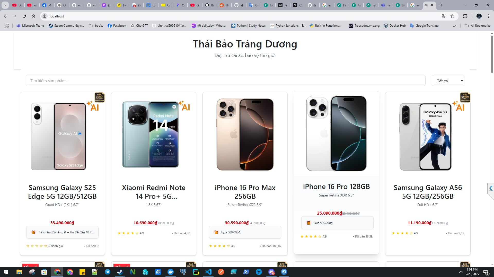
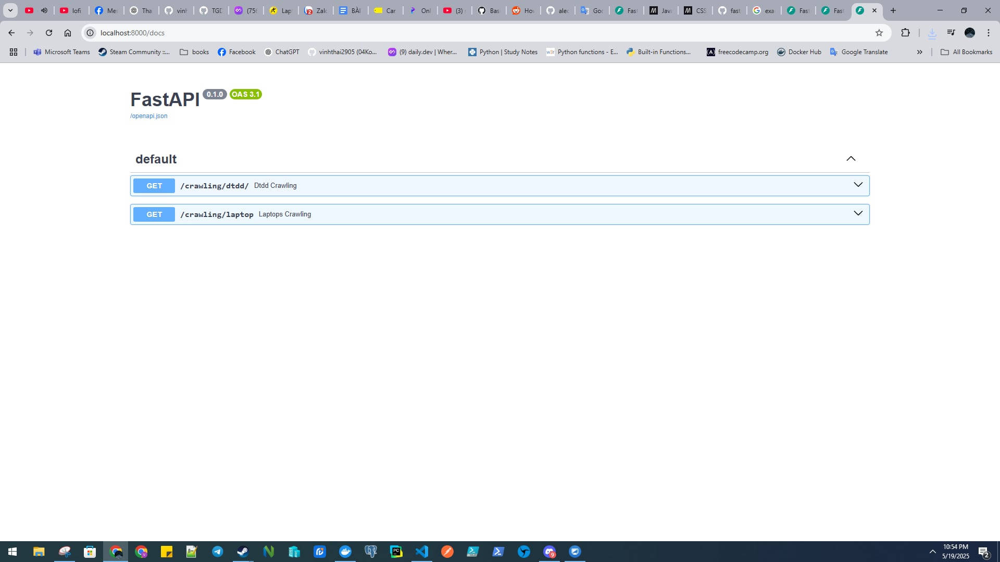
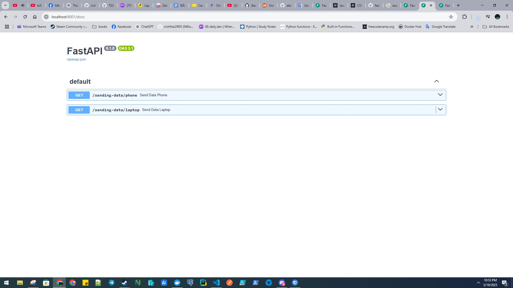
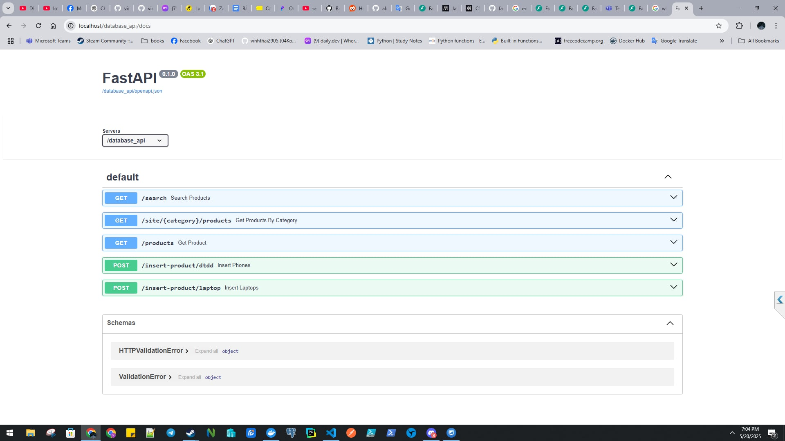

# TGDD Scraping Documents:
A simple API built with FastAPI and PostgreSQL, being containerized using Docker. The main goal is to scraping products.

> [!IMPORTANT]
> [Docker is must have software installed in your computer to set up this project.](https://www.docker.com/)

The websites in which product data are being scraped:

### 🌐 Sources:

- [https://www.thegioididong.com/dtdd](https://www.thegioididong.com/dtdd)
- [https://www.thegioididong.com/laptop](https://www.thegioididong.com/laptop)

## 🛠️ How It's Made:

### Programming & Markup Languages

🐍 [Python](https://www.python.org/)
🔄 [TypeScript](https://www.typescriptlang.org/)
🌐 [HTML](https://developer.mozilla.org/en-US/docs/Web/HTML)
🎨 [CSS](https://developer.mozilla.org/en-US/docs/Web/CSS)

### Core Tools:

🐘 [PostgreSQL](https://www.postgresql.org/)

🐳 [Docker](https://www.docker.com/) - Used for isolating services and encapsulating necessary things for the software instead of doing it 
traditional ways.

🧭 [NGINX](https://nginx.org/) - Acts as a gateway that routes frontend and backend services under a unified interface.

🧭 [NGINX](https://nginx.org/) - Acts as a gateway that routes frontend and backend services under a unified interface.

🧭 [NGINX](https://nginx.org/) - Acts as a gateway that routes frontend and backend services under a unified interface.

### Core Packages:

⚡ [FastAPI](https://fastapi.tiangolo.com/) - Used for building microservices for scraping and inserting data.

⚛️ [React](https://react.dev/) - Used for building dynamic front-end.

🧪 [SQLAlchemy](https://www.sqlalchemy.org/) - Used for opening connections towards the database engine and performing queries.

✅ [Pydantic](https://docs.pydantic.dev/latest/) - Used for validating incoming data through API endpoints.

### Web Scraping Packages

🍜 [BeautifulSoup](https://www.crummy.com/software/BeautifulSoup/bs4/doc/) - Used for catching static html tags.

🤖 [Selenium](https://www.selenium.dev/documentation/) - Used for automated browsing and handling dynamic content.

🌐 [Requests](https://requests.readthedocs.io/en/latest/) - Used for making HTTP(or HTTPS) to certain domains. In this particular topic [Sources](#tgdd-scraping-documents).

### Minor Packages:

📝 [Logging](https://docs.python.org/3/library/logging.html) - Used for writing logs for examining the results.

## 📘 Tasks List:
- ✅ Data Crawling API Serivce
- ✅ Data Ingestion API Service
- ✅ Database API Service
- ✅ Web Page Service
- ✅ Database Service
- ✅ nginx Service
- ✅ Logging
- ✅ Containerized Services
 
## 🛠️ Instructions:

### 💾 Clone the Repository

1. git clone https://github.com/vinhthai2905/TGDD_Scraping.git
2. cd TGDD_Scraping/base

### 🐳 Running with Docker Compose

3. docker-compose -f ./docker-compose.yml -p tgdd up --build

### 🔍 Examining logs

> [!TIP] 
> Open three terminal and type in each
 - docker attach data_crawling
 - docker attach data_ingestion
 - docker attach database_api

### 🛑 Stop the service

5. docker-compose -f./docker-compose.yml -p tgdd down

## 💡 Interactive Services Routed through [NGINX](https://nginx.org/)

### Web Page Service Container

### Data Crawling API Service Container

### Data Ingestion API Service Container

### Database API Service Container

## 📎 Navigators

➡️ [Go to Scraping Documents](#tgdd-scraping-documents)

➡️ [Go to How It's Made](#how-its-made)

➡️ [Go to How Tasks List](#tasks-list)

➡️ [Go to Instructions](#instructions)
